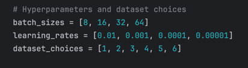

# Insect Image Classification

### 1. High level description/presentation
Please note that the source code requires the three dataset folders to not be moved elsewhere, because the code uses relative paths to access the images.
- The raw Datasets are present [here](Datasets), and the scripts which clean and organize each raw dataset is present [here](dataset_organizer).
- The small dataset used for testing the script is generated manually, and is present [here](tiny_datasets).

Please follow these steps in order to setup the datasets for further use.
1) Create a new Virtual Environment at the root folder.
2) Run ```cd dataset_organiser/``` 
3) Run ```python beeandwasp.py```
4) Run ```python InsectRecognitionDataset2.py```
5) Run ```python ThirdDatasetInsectCV.py```
6) Run ```cd ..```

Important naming information. We use the following numbers to identify different datasets in our code.
- Dataset ```1```: Tiny Dataset, Bee Or Wasp
- Dataset ```2```: Tiny Dataset, Insect Recognition
- Dataset ```3```: Tiny Dataset, Images CV
- Dataset ```4```: Organized Dataset, Bee Or Wasp
- Dataset ```5```: Organized Dataset, Insect Recognition
- Dataset ```6```: Organized Dataset, Images CV

Now, we should have all three cleaned and pre-processed datasets in the newly created folder titled "organized_datasets".
These organized datasets are common for all training across all models.

### 2. Requirements to run the Python code
Please ensure you have all of the following requirements before you run any of the following code:
```
torch
numpy
torchvision
matplotlib
scikit-learn
seaborn
pandas
tabulate
```
These dependencies are present as part of the [requirements.txt](requirements.txt) file as well, so you can run ```pip install -r requirements.txt```. We should now be ready to execute training and validation.

### 3. Instruction on how to train/validate the models
Once the organized datasets have been created, we can go into either of these folders and follow the respective steps -

#### Mobilenet
- For running the training from scratch, ensure that the file [mobilenet.py](mobilenet/mobilenet.py) (at line 272) has you required training parameters before running ```python mobilenet.py```.
- For running the training from pretrained model, ensure that the file [mobilenet_pretrained.py](mobilenet/mobilenet_pretrained.py) (at line 272) has you required training parameters before running ```python mobilenet_pretrained.py```. 



#### ResNet
- For running the training from scratch, ensure that the file [resnet.py](resnet/resnet.py) (at line 272) has you required training parameters before running ```python resnet.py```. 
- For running the training pretrained model, ensure that the file [resnet_pretrained.py](resnet/resnet_pretrained.py) (at line 272) has you required training parameters before running ```python resnet_pretrained.py```.


### 4. Instructions on how to run the pre-trained model on the provided sample test dataset
The sample test dataset is present [here](tiny_datasets). The model.pth files that were generated as part of training is present [here](models).
These models can be used by importing them using pytorch's load library. After that, we can run the model on the sample dataset. A sample script for 1 such model file is given in the validation [script](models/validation.py).

### 5. Source Code package in PyTorch
- All the relevant source code for cleaning, pre-processing and organizing raw datasets are [here](dataset_organizer).
- All the relevant source code for MobileNet is present in the folder [mobilenet](./mobilenet).
- All the relevant source code for ResNet is present in the folder [resnet](./resnet)

### 6. Description on how to obtain the Dataset from an available download link
We have included the [Datasets](./Datasets/) in this repository. They will be downloaded once the repository is cloned.
But, if you wish to download the raw datasets from the original source, you may do so using the following links below :
- Bee Or Wasp: [here](https://www.kaggle.com/datasets/jerzydziewierz/bee-vs-wasp)
- Insect Recognition: [here](https://www.kaggle.com/datasets/hammaadali/insects-recognition)
- Images CV: [here](https://images.cv/dataset/insects-image-classification-dataset)
